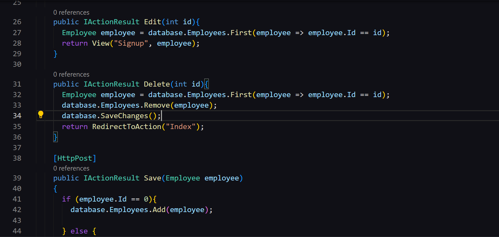
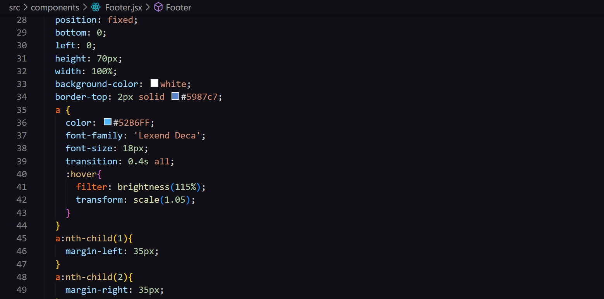
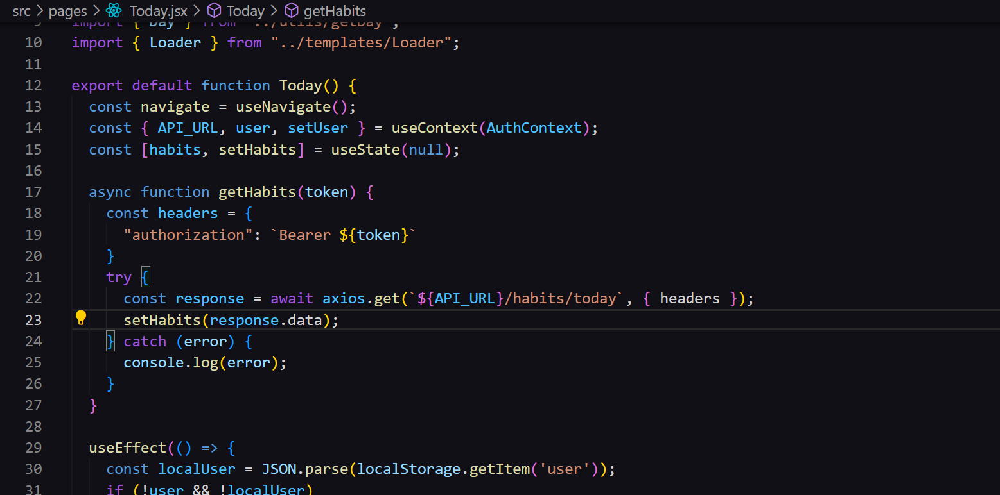
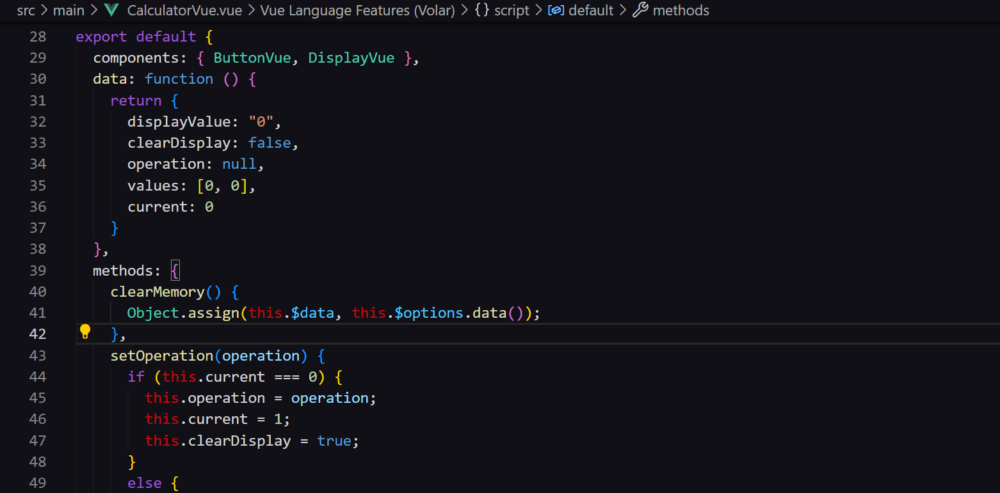

# Dark-Wolf Theme

#### One more dark theme for <a href="http://code.visualstudio.com/">Visual Studio Code</a>

#### Screenshots
Full window

 
Some Asp.Net code

 
How it looks with css

 
Some React code

 
Some Vue code

# Team

<a href="https://tsaytson.github.io">
  
  
Thiago Saytson

</a>

<a href="https://www.linkedin.com/in/mariana-s-carvalho/">
  
  
Mariana Carvalho

</a>

## Reach us at

<a href="https://www.linkedin.com/in/thiago-saytson/">
<h3>Thiago Saytson</h3>

</a>

<a href="https://www.linkedin.com/in/mariana-s-carvalho/">
<h3>Mariana Carvalho</h3>

</a>

 

**Enjoy!**
