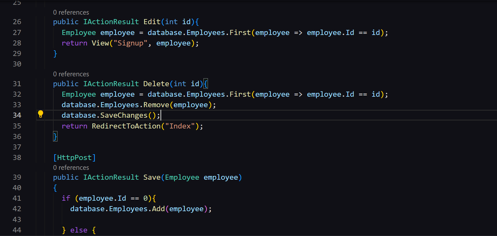
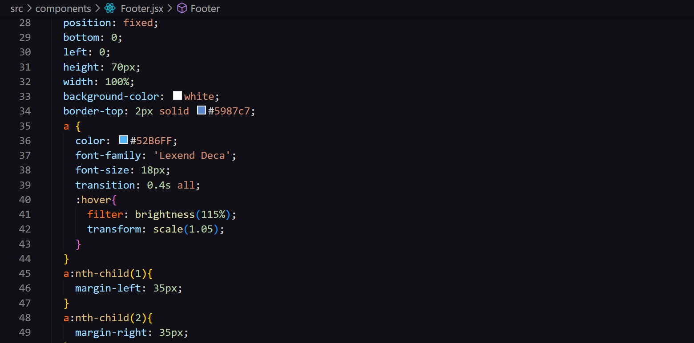
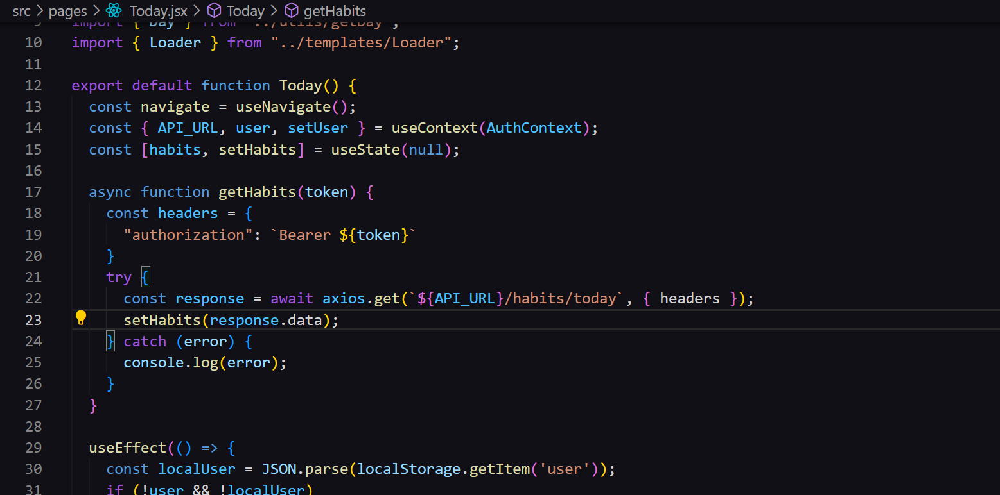
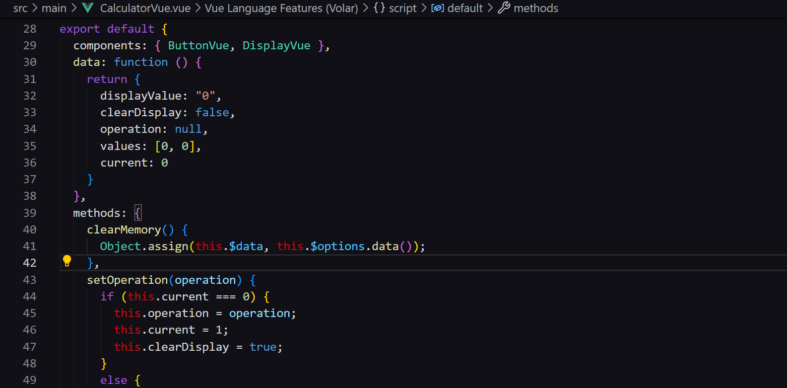

# Say-Dark Theme

#### One more dark theme for <a href="http://code.visualstudio.com/">Visual Studio Code</a>

#### Screenshots
Full window

 
Some Asp.Net code

 
How it looks with css

 
Some React code

 
Some Vue code

# Team
#### Maintained only by me for now

<a href="https://tsaytson.github.io">
  
  <h1>Thiago Saytson</h1>
</a>

## Reach me at

**Enjoy!**
